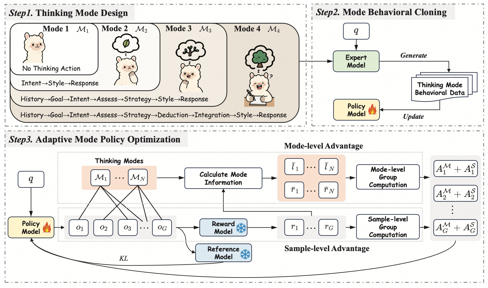
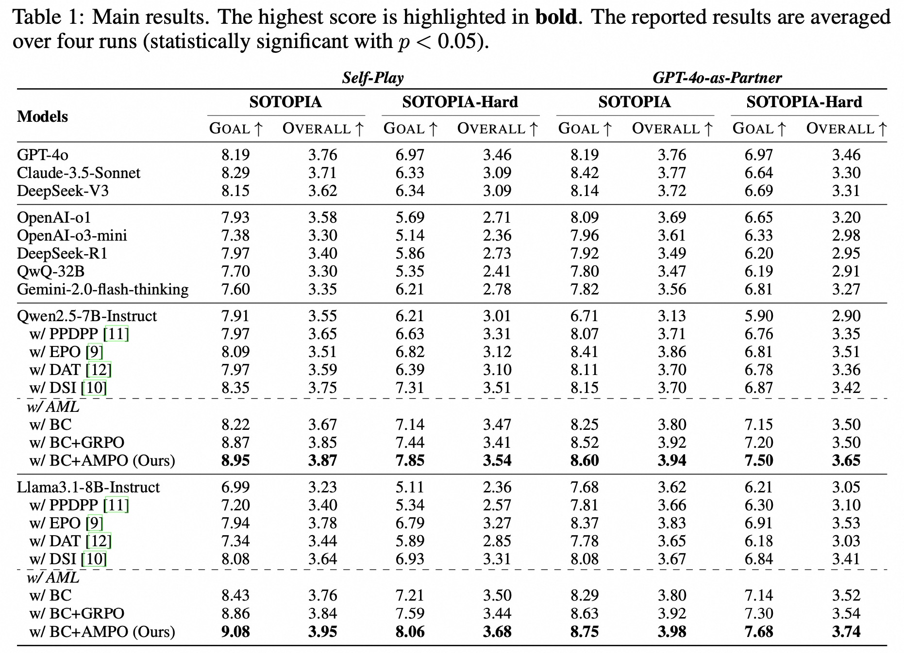
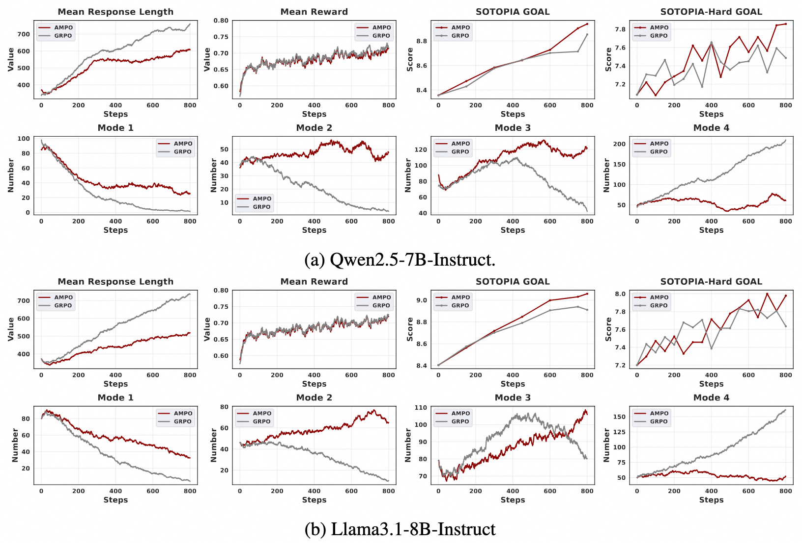
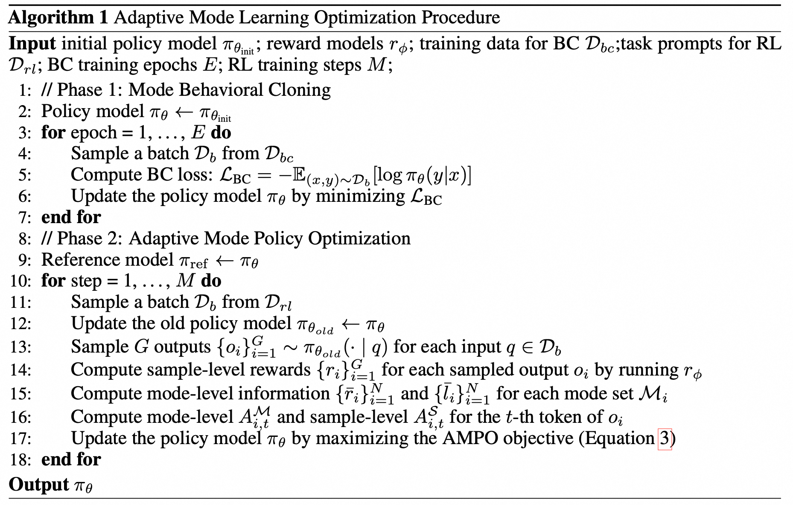

<div align="center">

## **Complex Instruction Following (IF) & Reasoning for Deep Analysis**  

### Built by Tongyi Lab, Alibaba Group 

</div>

# AMPO: 面向社交语言智能体的自适应思考与模式策略优化

<p align="center">
    
</p>

<div align='center'>
<br>
<a href="https://scholar.google.com.hk/citations?user=glV21ZsAAAAJ&hl=zh-CN">Minzheng Wang</a><sup><span>1,2</span></sup>, 
<a>Yongbin Li</a><sup><span>3</span></sup>,
<a>Haobo Wang</a><sup><span>4</span></sup>,
<a href="https://xinghuazhang.top/">Xinghua Zhang</a><sup><span>3🌟</span></sup>,
<br>
<a>Nan Xu</a><sup><span>1</span></sup>,
<a>Bingli Wu</a><sup><span>3</span></sup>,
<a>Fei Huang</a><sup><span>3</span></sup>,
<a>Haiyang Yu</a><sup><span>3</span></sup>,
<a>Wenji Mao</a><sup><span>1,2🌟</span></sup>
<br>

🌟 通信作者

<sup>1</sup> 中国科学院自动化研究所，MAIS<br>
<sup>2</sup> 中国科学院大学人工智能学院<br>
<sup>3</sup> 阿里巴巴集团，通义实验室<br>
<sup>4</sup> 北京大学<br>

<font size=3><div align='center' >  [[📖 ArXiv 论文](https://arxiv.org/pdf/2505.02156)] [[📊 代码](https://github.com/MozerWang/AMPO)] [[😊 数据](https://huggingface.co/datasets/iiiiwis/AMPO)] [[🏆 模型 (即将发布)](https://huggingface.co)]  </div></font>

</div>


## 👀 概览
本仓库包含我们论文 **《Adaptive Thinking via Mode Policy Optimization for Social Language Agents》** 的代码和数据。在本文中，我们提出了 **自适应模式学习（Adaptive Mode Learning, AML）** 框架，旨在赋予社交智能体自适应思考的能力，使其能够根据社交互动情境的动态变化做出有效回应。
具体来说，我们首先受到层次化认知控制理论的启发，构建了四种思考模式，涵盖了从直觉反应、浅层思考、策略性思考到深度思考的完整范围。
接着，我们通过思维模式注入来训练模型，该过程包括通过行为克隆学习基础模式，以及基于强化学习的自适应思考模式增强。
针对强化学习增强，我们针锋相对地提出了 **自适应模式策略优化（Adaptive Mode Policy Optimization, AMPO）** 算法，该算法将模式级和样本级信息融入优势估计中，以加强上下文感知的思考模式切换。
在奖励函数方面，我们设计了三种奖励函数，包括答案奖励、格式奖励和答案长度奖励，为选择合适的思考模式和答案提供反馈。

## 主要结果
<p align="center">
    
</p>
<p align="center">
    
</p>

> 大量实验结果表明，与强大的基线相比，AML 和 AMPO 取得了目前最先进的性能。详情请参阅论文。

## 🔥 更新

- [2025.05.04]🔥AMPO 来了！我们发布了 [论文](https://arxiv.org/pdf/2505.02156)、[代码](https://github.com/MozerWang/AMPO) 和 [数据](https://huggingface.co/datasets/iiiiwis/AMPO)！模型权重仍在安全审查中，即将发布！

## 🔧 如何使用
<p align="center">
    
</p>

> 完整的优化流程。我们采用两阶段训练程序：第一阶段利用模式行为克隆，使模型能够准确理解并遵循特定的思考模式。在第二阶段，我们执行自适应模式策略优化，以增强自适应思考模式的切换和推理能力。

**第一步** 创建 conda 环境并安装其他依赖项。
1. 克隆本仓库
```shell
git clone https://github.com/MozerWang/AMPO
cd AMPO
```
2. 创建 BC conda 环境 (LLaMA Factory)。
```shell
conda create --name BC python=3.11 -y
conda activate BC
cd BC 
pip install -e ".[torch,metrics]"
```
3. 创建 RL conda 环境 (verl)。
```shell
# RL 环境 (verl)
conda create --name RL python=3.11 -y
conda activate RL
cd RL
pip3 install -e ".[vllm]"
pip install -r requirements.txt
```

> *您也可以参考 [verl](https://github.com/volcengine/verl) 和 [llamafactory](https://github.com/hiyouga/LLaMA-Factory/) 中的安装说明。*

**第二步** 从 huggingface 下载训练数据
```shell
git lfs install
git clone https://huggingface.co/datasets/iiiiwis/AMPO
```
**第三步** 准备模型 API

1. (**必须**) 在 `config/gpt_4o.yaml` 中设置您的 OPENAI 密钥（用于评估）
```shell
api_key: "您的 OPENAI 密钥"
api_url: "API 地址"
```

2. (**必须**) 在 `config/qwen2.5_72b_instruct.yaml` 中设置您的密钥（用于奖励模型）
```shell
api_key: "您的密钥"
api_url: "API 地址"
# 我们也推荐使用 vLLM。我们使用实现了 OpenAI Completions 和 Chat API 的 HTTP 服务器。
# 在 config/*.yaml 中设置您的 vLLM 配置
```
**第四步** 行为克隆训练
```shell
conda activate BC
cd BC
## (必须) 首先在 ./BC/data/dataset_info.yaml 中设置 bc_training_data_path
sh train.sh
```

**第五步** 强化学习训练
```shell
conda activate RL
cd RL
## (必须) 首先，使用 ./RL/example/data_preprocess/sotopia.py 中的脚本将 rl 训练数据转换为 ".parquet" 格式
sh sotopia_ampo_llama3.1_8b.sh
sh sotopia_ampo_qwen2.5_7b.sh
```

**第六步** 评估与推理
```shell
conda activate RL
cd RL
sh infer.sh
## 显示结果
python result.py --env sotopia --data_path 你的结果路径
```

## 致谢
感谢这些出色的工作！
- [verl](https://github.com/volcengine/verl)
- [vllm](https://github.com/vllm-project/vllm)
- [llamafactory](https://github.com/hiyouga/LLaMA-Factory/)
- [dat](https://github.com/likenneth/dialogue_action_token)
- [sotopia](https://github.com/sotopia-lab/sotopia)

## 引文
```
@article{wang2025ampo,
      title={Adaptive Thinking via Mode Policy Optimization for Social Language Agents}, 
      author={Minzheng Wang and Yongbin Li and Haobo Wang and Xinghua Zhang and Nan Xu and Bingli Wu and Fei Huang and Haiyang Yu and Wenji Mao},
      year={2025},
      journal={arXiv preprint arXiv:2505.02156},
      url={https://arxiv.org/abs/2505.02156}
}
``` 
