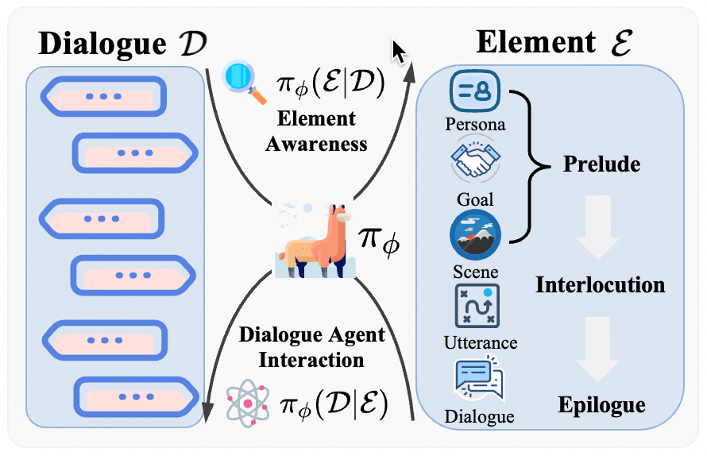

<div align="center">

## **Complex Instruction Following (IF) & Reasoning for Deep Analysis**  

### Built by Tongyi Lab, Alibaba Group 

</div>

<p align="center">
    
</p>

<div align="center">
<br>
<a href="https://scholar.google.com.hk/citations?user=glV21ZsAAAAJ&hl=zh-CN">Minzheng Wang</a><sup><span>1,2</span></sup>, 
<a href="https://xinghuazhang.top/">Xinghua Zhang</a><sup><span>3</span></sup>,
<a>Kun Chen</a><sup><span>1,2</span></sup>,
<a>Nan Xu</a><sup><span>2</span></sup>,
<br>
<a>Haiyang Yu</a><sup><span>3</span></sup>,
<a>Fei Huang</a><sup><span>3</span></sup>,
<a>Wenji Mao</a><sup><span>2,1🌟</span></sup>,
<a>Yongbin Li</a><sup><span>3🌟</span></sup>,
<br>

🌟 Corresponding author

<sup>1</sup> School of Artificial Intelligence, University of Chinese Academy of Sciences<br>
<sup>2</sup> MAIS, Institute of Automation, Chinese Academy of Sciences<br>
<sup>3</sup> Tongyi Lab, Alibaba Group<br>

<font size=3><div align='center' >  [[📖 ArXiv Paper](https://arxiv.org/abs/2412.04905)] [[📊 Code](https://github.com/MozerWang/DEMO)] [[🏆 Models](https://huggingface.co/iiiiwis/DEMO_Agent)] [[😊 Data](https://huggingface.co/datasets/iiiiwis/DEMO)]  </div></font>

</div>


## 👀 Overview
This repository contains code for our paper DEMO: Reframing Dialogue Interaction with Fine-grained Element Modeling. We systematically construct the dialogue framework from the *Prelude* through the *Interlocution* to the *Epilogue* and define an innovative research task: **D**ialogue **E**lement **MO**deling. Furthermore, we introduce a tailor-designed benchmark **DEMO** to facilitate comprehensive dialogue modeling and assessment. Concretely, our proposed task focuses on two core competencies of models: (1) **Element Awareness**, which entails reverse engineering to decompose dialogue elements, and (2) **Dialogue Agent Interaction**, which involves goal-directed multi-turn dialogue modeling driven by elements. We meticulously design a data synthesis framework, contributing to a novel benchmark for dialogue modeling that encompasses multifaceted elements applicable to both English and Chinese. Besides, inspired by imitation learning, we amass a substantial collection of expert experiences and build a DEMO agent endowed with dialogue element modeling.

## 🔥 Update

- [2024.12.07]🔥DEMO is coming! We release the [paper](https://arxiv.org/abs/2412.04905), [code](https://github.com/MozerWang/DEMO), [models](https://huggingface.co/iiiiwis/DEMO_Agent), and [data](https://huggingface.co/datasets/iiiiwis/DEMO) for dialogue element modeling!

## 🔧How to use
**Step1** Download DEMO and unzip data
```shell
git clone https://github.com/MozerWang/DEMO.git
cd DEMO
unzip data/DEMO.zip -d data/
```

**Step2** Create a conda environment and Install other dependencies.
```shell
conda create --name loong python=3.9 -y
conda activate DEMO
pip install -r requirements.txt
```

**Step3** Preparing the Model

1. (**Must**) Set up your OPENAI key in config/gpt_4o.yaml
```shell
api_key: "Your OPENAI key"
```
2. If you are using API-based LLM
```shell
# Firstly, Set up your key in config/*.yaml
api_key: "Your API key"
```
3. If you are using Open-sourced LLM
```shell
# We recommend using vLLM. And we use HTTP server that implements OpenAI’s Completions and Chat API.
# Set up your vLLM settings in config/*.yaml
```
**Step4** Evaluate
```shell
sh run.sh
```
## Citation
```
@inproceedings{wang-etal-2025-demo,
    title = "DEMO: Reframing Dialogue Interaction with Fine-grained Element Modeling",
    author = "Minzheng Wang, Xinghua Zhang, Kun Chen, Nan Xu, Haiyang Yu, Fei Huang, Wenji Mao, Yongbin Li",
    booktitle = "Findings of ACL 2025",
    month = July,
    year = "2025",
    address = "Vienna, Austria",
    publisher = "Association for Computational Linguistics"
}
```


