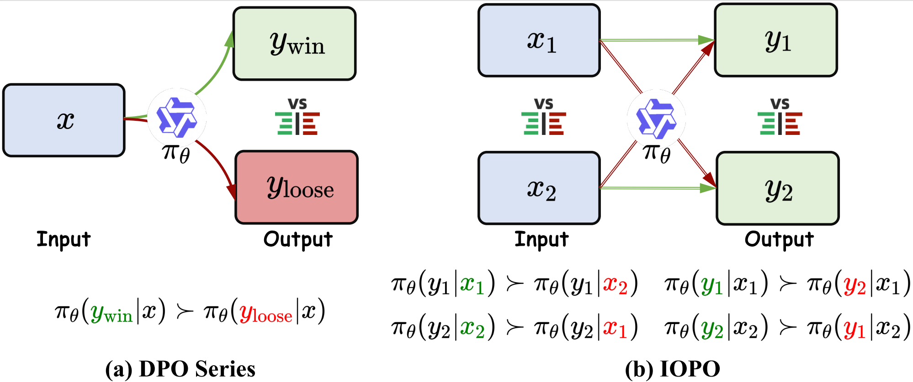
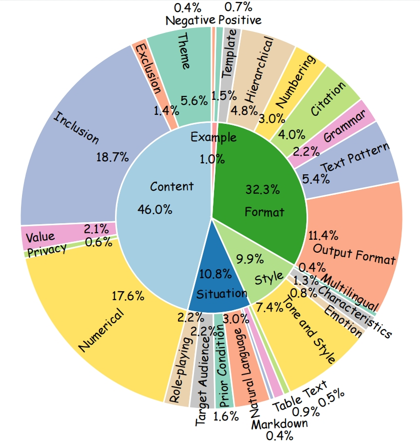

<div align="center">

# **Complex Instruction Following (IF) for Deep Analysis**  

### Built by Tongyi Lab, Alibaba Group 

</div>

> In the realm of large language models (LLMs), the ability of models to accurately follow instructions is paramount as more agents and applications leverage LLMs, where the complexity of instructions is rapidly increasing.

- [**TRACE&IOPO**](TRACE&IOPO) (ACL 2025) - [IOPO: Empowering LLMs with Complex Instruction Following via Input-Output Preference Optimization](https://arxiv.org/pdf/2411.06208)
- [**EIFBench&SegPO**](EIFBench&SegPO) (Preprint 2025) - [EIFBENCH: Extremely Complex Instruction Following Benchmark for Large Language Models](https://arxiv.org/pdf/2506.08375)

## 📜 News and Updates

- `2025.06.10` We release **EIFBench&SegPO** at [Arxiv](https://arxiv.org/pdf/2506.08375), an extremely complex instruction following benchmark and online RL algorithm for evaluating and training LLMs.
- `2025.05.16` **TRACE&IOPO** is accepted by ACL 2025 main conference.
- `2024.11.24` We release **TRACE&IOPO** at [DAMO-ConvAI](https://github.com/AlibabaResearch/DAMO-ConvAI/tree/main/IOPO), a complex instruction following benchmark and offline RL algorithm for evaluating and training LLMs.

## 🔬 Comparison Results  


## 📊 TRACE Benchmark
- **Training Instructions**: 119,345
- **Evaluation Instructions**: 1,042

**Constraints per Instruction:**  
- Minimum: **1**, Maximum: **15**  
- Average: **4.36** (training), **4.89** (evaluation)  



## ⚙ How to Run

### ➡ Step 1: Install Dependencies
```bash
cd TRACE&IOPO/IOPO/
pip install -e ".[torch,metrics]"
```

### ➡ Step 2: Train the Model
```bash
llamafactory-cli train examples/qwen2_lora_iopo.yaml
```

## 🧪 How to Evaluate

### ➡ Step 1: Launch `vllm` to Deploy the Trained Model
```bash
python -m vllm.entrypoints.openai.api_server \
    --served-model-name qwen2_7b_trace_iopo \
    --model <trained_model_saved_path> \
    --tensor-parallel-size 4
```

### ➡ Step 2: Run Evaluation Script
```bash
cd TRACE&IOPO/Eval_script/
bash evaluate_all_task_for_model.sh <eval_results_output_path> \
    "models/vllm_qwen2_7b_trace_iopo.yaml" \
    "config/evaluator-trace-gpt-gpt.yaml"
```

## 📄 License

The content of this project is licensed under the [LICENSE](LICENSE.txt).  

## 💬 Citation

If this work is helpful, please cite as:

```bibtex
@inproceedings{zhang-etal-2025-iopo,
    title = "IOPO: Empowering LLMs with Complex Instruction Following via Input-Output Preference Optimization",
    author = "Xinghua Zhang, Haiyang Yu, Cheng Fu, Fei Huang, Yongbin Li",
    booktitle = "Proceedings of the 63rd Annual Meeting of the Association for Computational Linguistics (ACL 2025)",
    month = July,
    year = "2025",
    address = "Vienna, Austria",
    publisher = "Association for Computational Linguistics"
}
@misc{zou2025eifbenchextremelycomplexinstruction,
      title={EIFBENCH: Extremely Complex Instruction Following Benchmark for Large Language Models}, 
      author={Tao Zou and Xinghua Zhang and Haiyang Yu and Minzheng Wang and Fei Huang and Yongbin Li},
      year={2025},
      eprint={2506.08375},
      archivePrefix={arXiv},
      primaryClass={cs.CL},
      url={https://arxiv.org/abs/2506.08375}, 
}
```

## ⭐ Star History
<div align="center">

[](https://www.star-history.com/#Tongyi-CCAI/Complex-IF&Date)

</div>

### 🎉 Thank you for your interest in **Complex IF**!  
