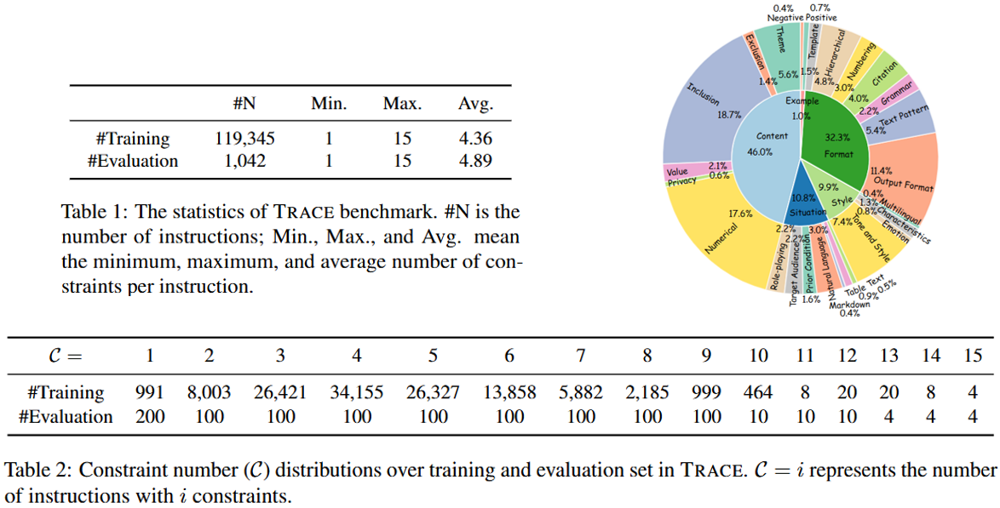

<div align="center">

## **Complex Instruction Following (IF) & Reasoning for Deep Analysis**  

### Built by Tongyi Lab, Alibaba Group 

</div>

> In the realm of large language models (LLMs), the ability of models to accurately follow instructions and conduct reasoning is paramount as more agents and applications leverage LLMs, where the complexity of instructions is rapidly increasing.

<div align="center">
<p align="center">
  
</p>
</div>

- [**TRACE**](TRACE) (-) - [IOPO: Empowering LLMs with Complex Instruction Following via Input-Output Preference Optimization](https://arxiv.org/pdf/2411.06208)
- [**IOPO**](IOPO) (ACL 2025) - [IOPO: Empowering LLMs with Complex Instruction Following via Input-Output Preference Optimization](https://arxiv.org/pdf/2411.06208)
- [**DEMO**](DEMO) (ACL 2025) - [DEMO: Reframing Dialogue Interaction with Fine-grained Element Modeling](https://arxiv.org/pdf/2412.04905)
- [**EIFBench**](EIFBench) (EMNLP 2025) - [EIFBENCH: Extremely Complex Instruction Following Benchmark for Large Language Models](https://arxiv.org/pdf/2506.08375)
- [**SegPO**](SegPO) (-) - [EIFBENCH: Extremely Complex Instruction Following Benchmark for Large Language Models](https://arxiv.org/pdf/2506.08375)
- [**AMPO**](AMPO) (Preprint 2025) - [Adaptive Thinking via Mode Policy Optimization for Social Language Agents](https://arxiv.org/pdf/2505.02156)

## 📜 News and Updates

- `2025.08.21` **EIFBench**&**SegPO** is accepted by EMNLP 2025 main conference. Code&Data is coming soon...
- `2025.06.10` We release **EIFBench**&**SegPO** at [Arxiv](https://arxiv.org/pdf/2506.08375), an extremely complex instruction following benchmark and online RL algorithm for evaluating and training LLMs.
- `2025.05.22` We release **AMPO** at [Arxiv](https://arxiv.org/pdf/2505.02156), a online RL algorithm for adaptive reasoning.
- `2025.05.16` **DEMO** is accepted by Findings of ACL 2025.
- `2025.05.16` **TRACE**&**IOPO** is accepted by ACL 2025 main conference.
- `2024.11.24` We release **TRACE**&**IOPO** at [DAMO-ConvAI](https://github.com/AlibabaResearch/DAMO-ConvAI/tree/main/IOPO), a complex instruction following benchmark and offline RL algorithm for evaluating and training LLMs.

## 🔬 Details

### 1. TRACE Benchmark  



### 2. IOPO  


### 3. DEMO Benchmark  


### 4. EIFBench Benchmark  


### 5. SegPO  


### 6. AMPO  


## ⚙ How to Run

The details can be found in the corresponding folders.

## 📄 License

The content of this project is licensed under the [LICENSE](LICENSE.txt).  

## 💬 Citation

If this work is helpful, please cite as:

```bibtex
@inproceedings{zhang-etal-2025-iopo,
    title = "IOPO: Empowering LLMs with Complex Instruction Following via Input-Output Preference Optimization",
    author = "Xinghua Zhang, Haiyang Yu, Cheng Fu, Fei Huang, Yongbin Li",
    booktitle = "Proceedings of the 63rd Annual Meeting of the Association for Computational Linguistics (ACL 2025)",
    month = July,
    year = "2025",
    address = "Vienna, Austria",
    publisher = "Association for Computational Linguistics"
}
@inproceedings{wang-etal-2025-demo,
    title = "DEMO: Reframing Dialogue Interaction with Fine-grained Element Modeling",
    author = "Minzheng Wang, Xinghua Zhang, Kun Chen, Nan Xu, Haiyang Yu, Fei Huang, Wenji Mao, Yongbin Li",
    booktitle = "Findings of ACL 2025",
    month = July,
    year = "2025",
    address = "Vienna, Austria",
    publisher = "Association for Computational Linguistics"
}
@misc{zou2025eifbenchextremelycomplexinstruction,
      title={EIFBENCH: Extremely Complex Instruction Following Benchmark for Large Language Models}, 
      author={Tao Zou and Xinghua Zhang and Haiyang Yu and Minzheng Wang and Fei Huang and Yongbin Li},
      year={2025},
      booktitle = "EMNLP 2025"
}
@misc{wang2025adaptivethinkingmodepolicy,
      title={Adaptive Thinking via Mode Policy Optimization for Social Language Agents}, 
      author={Minzheng Wang and Yongbin Li and Haobo Wang and Xinghua Zhang and Nan Xu and Bingli Wu and Fei Huang and Haiyang Yu and Wenji Mao},
      year={2025},
      eprint={2505.02156},
      archivePrefix={arXiv},
      primaryClass={cs.CL},
      url={https://arxiv.org/abs/2505.02156}, 
}
```

## ⭐ Star History

<picture>
  <source
    media="(prefers-color-scheme: dark)"
    srcset="
      https://api.star-history.com/svg?repos=Tongyi-CCAI/Complex-IF&type=Date&theme=dark
    "
  />
  <source
    media="(prefers-color-scheme: light)"
    srcset="
      https://api.star-history.com/svg?repos=Tongyi-CCAI/Complex-IF&type=Date
    "
  />
  
</picture>

### 🎉 Thank you for your interest in **Complex IF**!  
